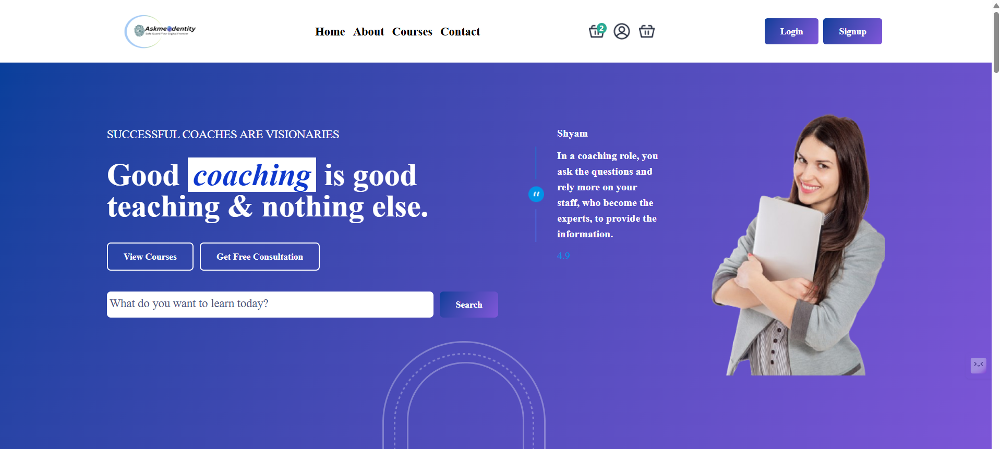

# Education Teaching Platform - Landing Page

A fully responsive and modern **landing page** for an Education Teaching Platform, designed based on a Figma mock and built using **HTML** and **Tailwind CSS**. The page showcases educational services, featured courses, company highlights, testimonials, and more — tailored for startups or institutions in the e-learning domain.

## 🔗 Live Demo

[View Live Demo](https://edutech-webs.netlify.app/) <!-- Replace with Netlify/Vercel/GitHub Pages URL -->

---

## 📸 Preview

 <!-- Optional: Add screenshot -->

---

## ✨ Features

- ✅ Fully responsive (mobile, tablet, desktop)
- ✅ Navigation bar with branding and CTA
- ✅ Hero section with headline and supporting text
- ✅ Company logos ("Trusted by", "Hired by", etc.)
- ✅ Featured courses section with pricing, ratings, and descriptions
- ✅ "Why Learn With Us" section with unique selling points
- ✅ Popular course categories (e.g., Web Development, Digital Marketing)
- ✅ Embedded promotional video section
- ✅ Testimonials from learners
- ✅ Newsletter subscription form
- ✅ Footer with useful links and branding

---

## 🛠 Tech Stack

- **HTML5**
- **Tailwind CSS** (via CDN or CLI)
- No JavaScript frameworks used

---

## 🚀 Getting Started

If you want to run this project locally:

### 1. Clone the repository

```bash
git clone https://github.com/your-username/education-landing-page.git
cd education-landing-page

---
### 🙌 Credits

Developed with ❤️ by [Ramana S](https://github.com/CodeRamana)